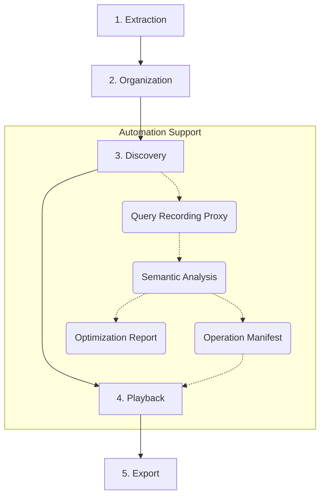

# Archivolt Core Workflow Guide

This guide details how to use Archivolt from scratch to comb through a legacy database and transform it into a modernized, strongly-typed development asset.

---

## Prerequisites

| Tool | Purpose | Installation |
|------|---------|--------------|
| [Bun](https://bun.sh) ≥ 1.0 | Runtime Environment | `curl -fsSL https://bun.sh/install \| bash` |
| [dbcli](https://github.com/CarlLee1983/dbcli) | DB Schema Extraction | See dbcli README |
| Chrome Extension (Optional) | Browser Behavior Markers | Load `extension/` as unpacked |

Once installed, run a health check to ensure your environment is ready:

```bash
archivolt doctor
```

---

## Overall Workflow



---

## Phase 1: Extraction

Archivolt uses an "offline analysis" mode, operating through a JSON specification file, without directly connecting to your production database.

### 1. Extract Schema

Use dbcli to scan your database:

```bash
dbcli schema --format json > my-database.json
```

### 2. Import into Archivolt

```bash
archivolt --input my-database.json
```

Archivolt will parse all tables, columns, primary keys, and physical foreign keys.

### 3. Re-import (Preserve Annotations)

When the database structure changes, use `--reimport` to update. Archivolt will preserve your previously manual annotations (vFKs) and grouping settings:

```bash
archivolt --input my-database.json --reimport
```

---

## Phase 2: Organization

When facing hundreds of tables in a legacy system, the first task is "noise reduction."

### 1. Start Interface

```bash
# Start both API Server and Web Frontend
bun run dev:all
```

Open [http://localhost:5173](http://localhost:5173) in your browser to enter the ER canvas.

### 2. Table Filtering and Search

- **Column Keyword Filter**: Type a column name in the search box; the canvas will automatically hide tables that do not contain that column.
- **Table Name Filter**: Supports direct filtering by table name to quickly locate specific entities.
- **LOD (Level of Detail)**: Automatically hides column details when zoomed out to maintain performance.

### 3. Smart Grouping

Archivolt provides grouping suggestions based on table prefixes or common column naming conventions. You can:

- **Drag to Group**: Drag related tables into the same group box to define clear domain boundaries.
- **Rename**: Name each group to reflect business semantics (e.g., "Order", "Member", "Inventory").
- **Merge / Split**: Adjust automatic grouping results according to actual business logic.

### 4. Hide Noise

Hide unimportant logging, backup, or temporary tables from the main canvas to keep the core structure clear.

---

## Phase 3: Discovery & Annotation

The most critical step: finding those "implicit" relationships that exist in name only.

### Method A: Manual vFK Annotation

Drag a line directly from one table to another on the canvas. A **Column Selector** will pop up, allowing you to specify the source and target column mapping. Once confirmed, a **Virtual Foreign Key (vFK)** is created.

### Method B: Query Recording (Auto-Discovery)

Let Archivolt "listen" to what your application is saying.

#### Step 1: Start Recording Proxy

```bash
# Method 1: Specify target directly
archivolt record start --target production-db:3306 --port 13306

# Method 2: Read from .env file
archivolt record start --from-env /path/to/project/.env
```

#### Step 2: Use Chrome Extension (Optional)

Install the extension from the `extension/` directory. It will automatically send behavior markers (navigate, submit, click, request) as you interact with your app.

#### Step 3: Switch Connection and Execute Flows

Point your application's DB host to `127.0.0.1` and port to `13306`, then operate the features you want to analyze.

#### Step 4: Stop Recording

Press `Ctrl+C` in the recording terminal.

### Method C: Semantic Analysis (Operation Manifest)

Transform raw SQL into a structured operation list:

```bash
archivolt analyze <session-id>
```

### Method D: VFK Review UX (New ✨)

Relationship suggestions generated after recording analysis can now be managed through a dedicated **Review Interface**:

1. **Enter Review Tab**: Click "Review" in the navbar. A count badge will show if there are new suggestions.
2. **Three-State Management**:
   - **Pending**: Auto-detected potential relationships.
   - **Confirmed**: Manually verified and officially applied to the schema.
   - **Ignored**: Marked as noise or incorrect suggestions.
3. **Instant Apply**: Click "Confirm" to immediately see the relationship on the canvas and update `archivolt.json`.

---

## Phase 4: Timeline Playback

The built-in Timeline panel allows you to visually replay recorded sessions to understand business flows.

---

## Phase 5: Export & Integration

```bash
# Laravel Eloquent
archivolt export eloquent --laravel /path/to/project

# Prisma Schema
archivolt export prisma --output ./output
```

---

## Health Check (Doctor)

`archivolt doctor` performs a full environment and data check, offering interactive fixes when issues are found.

```bash
archivolt doctor
```
