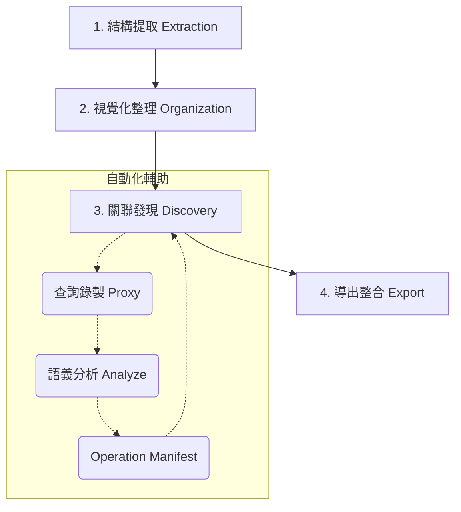

# 🌊 Archivolt 核心工作流指南

本指南詳細說明如何使用 Archivolt CLI 工具從零開始梳理一套老舊資料庫，並將其轉化為現代化、具備強型別關聯的開發資產。

---

## 🛠️ 整體作業流程

Archivolt 的工作流程分為四個主要階段：



---

## 階段 1：結構提取 (Extraction)

Archivolt 採用「離線分析」模式，透過 JSON 規格書運作，不直接連線到您的生產環境資料庫。

1. **提取 Schema**：
   使用 [dbcli](https://github.com/CarlLee1983/dbcli) 掃描您的資料庫：
   ```bash
   dbcli schema --format json > my-database.json
   ```
2. **匯入 Archivolt**：
   ```bash
   archivolt --input my-database.json
   ```
   此時 Archivolt 會解析所有的資料表、欄位、主鍵以及物理外鍵。

---

## 階段 2：視覺化整理 (Organization)

面對動輒數百張資料表的老舊系統，首要任務是「降噪」。

1. **啟動介面**：
   ```bash
   archivolt
   ```
   執行後開啟瀏覽器訪問 `http://localhost:3100`。
2. **智慧分組 (Smart Grouping)**：
   - Archivolt 會根據資料表前綴或常見的欄位命名慣例自動分組。
   - 您可以在畫布上將相關的資料表拖入同一個「分組框」中，定義清晰的領域 (Domain) 邊界。
3. **隱藏雜訊**：將不重要的紀錄表、備份表從主畫布中隱藏。

---

## 階段 3：關聯發現與標註 (Discovery & Annotation)

這是最關鍵的一步：找出那些「有名無實」的隱性關聯。

### 1. 手動標註 vFK
如果您已經知道某些關聯，直接在畫布上從一個欄位拉線到另一個欄位。這會建立一個 **虛擬外鍵 (Virtual Foreign Key)**。

### 2. 查詢錄製 (自動發現)
讓 Archivolt 「聽」您的應用程式在說什麼：
1. **啟動錄製代理**：
   ```bash
   archivolt record start --target production-db:3306 --port 13306
   ```
2. **搭配瀏覽器擴充功能**：安裝 Archivolt Chrome Extension，它會在您操作畫面時自動送出行為標記（Marker）。
3. **切換連線**：將您的應用程式資料庫 Host 改為 `127.0.0.1`，Port 改為 `13306`。
4. **執行業務流程**：在瀏覽器操作您想分析的功能。

### 3. 語義分析 (Operation Manifest)
錄製完成後，產出一份結構化的中間文件：
1. **執行分析命令**：
   ```bash
   archivolt analyze <session-id>
   ```
2. **產出物 (Operation Manifest)**：
   在 `data/analysis/<session-id>/manifest.md` 產出的文件包含：
   - **操作清單**：將 SQL 與瀏覽器行為精確對應，並推斷語義。
   - **Table Matrix**：呈現各資料表在流程中的讀寫參與度。
   - **關係推斷**：自動識別 `JOIN` 產生的虛擬外鍵建議。
3. **用途**：
   - **AI 驅動開發**：作為 AI Agent (如 Claude Code) 的導航地圖。
   - **技術存檔**：老舊系統行為模式的正式報告。

---

## 階段 4：導出與整合 (Export & Integration)

### 1. 生成 ORM 模型
- **Laravel Eloquent**：
  ```bash
  archivolt export eloquent --laravel /path/to/project
  ```
- **Prisma**：
  生成具備完整關係定義的 `schema.prisma`。

### 2. 生成技術文件
- **Mermaid/DBML**：
  將標註畫布導出為可嵌入 Markdown 的圖表。

---

## 💡 小貼士 (Tips)

- **健康檢查**：執行 `archivolt doctor` 檢查環境配置是否正確。
- **保持同步**：結構有變動時，使用 `archivolt --input schema.json --reimport` 重新匯入並保留手動標註。
- **LLM 友善**：生成的 `archivolt.json` 包含了所有的元數據，可直接提供給 AI 協助編寫查詢。
