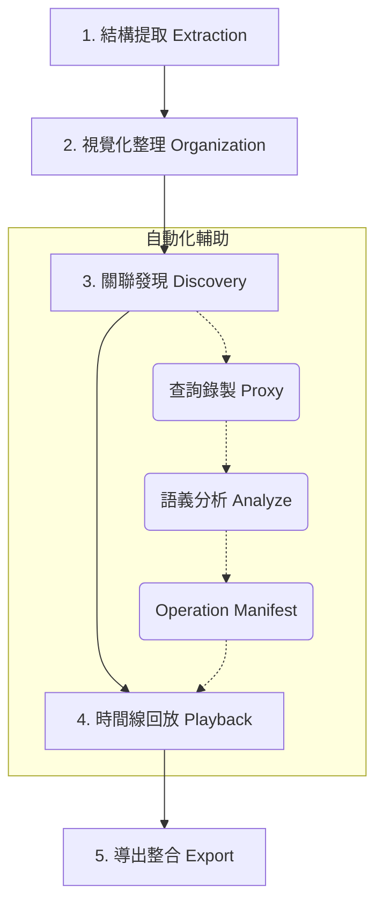

# Archivolt 核心工作流指南

本指南詳細說明如何使用 Archivolt 從零開始梳理一套老舊資料庫，並將其轉化為現代化、具備強型別關聯的開發資產。

---

## 先決條件

| 工具 | 用途 | 安裝方式 |
|------|------|---------|
| [Bun](https://bun.sh) ≥ 1.0 | 執行環境 | `curl -fsSL https://bun.sh/install \| bash` |
| [dbcli](https://github.com/CarlLee1983/dbcli) | 資料庫 Schema 提取 | 參見 dbcli README |
| Chrome Extension（選用） | 瀏覽器行為標記 | 載入 `extension/` 為未封裝擴充功能 |

安裝完成後，執行健康檢查確認環境就緒：

```bash
archivolt doctor
```

---

## 整體作業流程



---

## 階段 1：結構提取 (Extraction)

Archivolt 採用「離線分析」模式，透過 JSON 規格書運作，不直接連線到您的生產環境資料庫。

### 1. 提取 Schema

使用 dbcli 掃描您的資料庫：

```bash
dbcli schema --format json > my-database.json
```

### 2. 匯入 Archivolt

```bash
archivolt --input my-database.json
```

此時 Archivolt 會解析所有的資料表、欄位、主鍵以及物理外鍵。

### 3. 重新匯入（保留標註）

當資料庫結構有變動時，使用 `--reimport` 重新匯入。Archivolt 會保留您先前手動標註的虛擬外鍵（vFK）和分組設定：

```bash
archivolt --input my-database.json --reimport
```

---

## 階段 2：視覺化整理 (Organization)

面對動輒數百張資料表的老舊系統，首要任務是「降噪」。

### 1. 啟動介面

```bash
archivolt
```

開啟瀏覽器訪問 `http://localhost:3100`，進入 ER 畫布。

### 2. 智慧分組 (Smart Grouping)

Archivolt 會根據資料表前綴或常見的欄位命名慣例自動建議分組。您可以：

- **拖曳分組**：將相關的資料表拖入同一個分組框中，定義清晰的領域 (Domain) 邊界
- **重新命名**：為每個分組命名以反映業務語意（例如「訂單」、「會員」、「庫存」）
- **合併 / 拆分**：根據實際業務邏輯調整自動分組的結果

### 3. 隱藏雜訊

將不重要的紀錄表、備份表、暫存表從主畫布中隱藏，讓核心結構一目了然。

---

## 階段 3：關聯發現與標註 (Discovery & Annotation)

這是最關鍵的一步：找出那些「有名無實」的隱性關聯。

### 方式 A：手動標註 vFK

直接在畫布上從一個表拉線到另一個表，會彈出 **Column 選擇器**，讓您指定 source column 和 target column 的對應關係。確認後即建立一個 **虛擬外鍵 (Virtual Foreign Key)**。選擇器會智慧預設最可能的欄位（如 `user_id → id`），但您可以手動切換為任意欄位組合。

### 方式 B：查詢錄製（自動發現）

讓 Archivolt 「聽」您的應用程式在說什麼。

#### 步驟 1：啟動錄製代理

**方式一：指定目標**

```bash
# MySQL（預設）
archivolt record start --target production-db:3306 --port 13306

# PostgreSQL（自動偵測 port 5432）
archivolt record start --target production-db:5432 --port 15432

# 手動指定協議
archivolt record start --target db:3306 --protocol postgres
```

Archivolt 會自動偵測資料庫協議：port 5432 → PostgreSQL，port 3306 → MySQL。也可用 `--protocol mysql|postgres` 手動指定。

**方式二：從 .env 讀取連線資訊**（更方便）

```bash
archivolt record start --from-env /path/to/project/.env
```

會自動讀取 `.env` 中的 `DB_HOST`、`DB_PORT`，以及 `DB_CONNECTION` / `DB_DRIVER`（用於判斷協議）。預設 Proxy 監聽 `13306`。

#### 步驟 2：搭配 Chrome Extension（選用）

安裝方式：

1. 開啟 Chrome → `chrome://extensions`
2. 啟用「開發人員模式」
3. 點選「載入未封裝項目」→ 選擇專案的 `extension/` 目錄

Extension 會在您操作畫面時自動送出行為標記（Marker），包含：
- 頁面導航 (`navigate`)
- 表單送出 (`submit`)
- 點擊事件 (`click`)
- API 請求 (`request`)

#### 步驟 3：切換連線並執行業務流程

將您的應用程式資料庫 Host 改為 `127.0.0.1`，Port 改為 `13306`，然後在瀏覽器中操作您想分析的功能。

#### 步驟 4：停止錄製

在錄製終端按 `Ctrl+C` 結束。

#### 管理錄製 Session

```bash
# 列出所有 session
archivolt record list

# 檢視某個 session 的摘要
archivolt record summary <session-id>

# 查看目前錄製狀態
archivolt record status
```

### 方式 C：語義分析 (Operation Manifest)

錄製完成後，執行分析將原始 SQL 轉化為結構化的操作清單：

```bash
# 預設輸出 Markdown
archivolt analyze <session-id>

# 輸出 JSON 格式
archivolt analyze <session-id> --format json

# 指定輸出路徑
archivolt analyze <session-id> --output ./reports/manifest.md

# 直接輸出到 stdout（適合 pipe 給其他工具）
archivolt analyze <session-id> --format json --stdout
```

產出的 Operation Manifest 包含：

| 區塊 | 內容 |
|------|------|
| **操作清單** | 將 SQL 與瀏覽器行為精確對應，推斷語義（read / write / mixed） |
| **Table Matrix** | 各資料表在流程中的讀寫參與度統計 |
| **關係推斷** | 從 `JOIN` 條件自動識別的虛擬外鍵建議 |

**用途**：
- **AI 驅動開發**：作為 AI Agent (如 Claude Code) 的導航地圖
- **技術存檔**：老舊系統行為模式的正式報告

### 方式 D：批次匯入推斷關係

語義分析產出的推斷關係可以直接匯入為 vFK：

```bash
# 互動模式（逐一確認，預設只匯入 high confidence）
archivolt apply <session-id>

# 降低信心度門檻
archivolt apply <session-id> --min-confidence medium

# 預覽不寫入
archivolt apply <session-id> --dry-run

# 自動全部套用（適合 script）
archivolt apply <session-id> --auto
```

已存在的 vFK 或 FK 會自動跳過，不會重複。

### 方式 E：比較兩個 Session

比較同一功能在不同時間點（如重構前後）的資料庫存取差異：

```bash
# 輸出 Markdown 到 console
archivolt diff <session-a> <session-b>

# 輸出 JSON
archivolt diff <session-a> <session-b> --format json --stdout

# 儲存到檔案
archivolt diff <session-a> <session-b> --output ./reports/diff.md
```

比較內容包含：新增/消失的 table、讀寫次數變化、關係推斷差異、統計摘要。

---

## 階段 4：時間線回放 (Timeline Playback)

前端內建的 Timeline 面板可以將錄製的 Session 以視覺化方式回放，幫助您理解業務流程。

### 使用方式

1. 啟動 Archivolt 伺服器（`archivolt`）
2. 在畫布右側的 Timeline 面板中選擇一個 Session
3. 點擊播放按鈕，逐步檢視每個操作 Chunk

### 回放控制

| 操作 | 說明 |
|------|------|
| 播放 / 暫停 | 自動依序播放每個 Chunk |
| 上一步 / 下一步 | 手動逐步瀏覽 |
| 速度調整 | 支援 0.5x、1x、2x、4x 播放速度 |
| 自動聚焦 | 畫布自動平移到活躍表群（可關閉） |

### Chunk 卡片資訊

每張 Chunk 卡片顯示：
- 操作類型圖示（導航、送出、點擊、API 請求）
- 關聯的資料表
- SQL 查詢數量與耗時
- 讀寫模式標籤（`read` / `write` / `mixed`）
- Edge 上的讀寫方向標記（R / W / R/W，以顏色區分）

---

## 階段 5：導出與整合 (Export & Integration)

### 生成 ORM 模型

```bash
# Laravel Eloquent（寫入專案目錄）
archivolt export eloquent --laravel /path/to/project

# Prisma Schema
archivolt export prisma --output ./output

# 輸出到 stdout
archivolt export prisma
```

### 生成技術文件

```bash
# Mermaid ER 圖（可嵌入 Markdown）
archivolt export mermaid

# DBML 格式
archivolt export dbml --output ./output
```

支援的匯出格式：

| 格式 | 用途 |
|------|------|
| `eloquent` | Laravel Eloquent Model，支援 `--laravel` 直接寫入專案 |
| `prisma` | Prisma Schema，包含完整關係定義 |
| `mermaid` | Mermaid ER Diagram，可嵌入文件 |
| `dbml` | DBML 格式，可用於 dbdiagram.io |

---

## 健康檢查 (Doctor)

`archivolt doctor` 會執行完整的環境與資料檢查，並在發現問題時提供互動修復。

### 檢查項目

**環境檢查：**
- Bun 版本是否符合要求
- dbcli 是否可用
- Port 3100 是否被佔用
- 後端 / 前端相依套件是否安裝
- 錄製目錄是否存在

**資料完整性：**
- `archivolt.json` 是否可讀取
- Schema 結構是否正確
- 虛擬外鍵（vFK）參照是否完整
- 資料表分組參照是否一致
- 錄製資料是否完整

```bash
# 互動模式（發現問題可即時修復）
archivolt doctor

# 僅檢查不修復
archivolt doctor --no-fix
```

啟動伺服器時也會自動執行靜默檢查，有問題才會顯示摘要。

---

## CLI 指令速查

| 指令 | 說明 |
|------|------|
| `archivolt` | 啟動伺服器 + 前端 |
| `archivolt --input <file>` | 匯入 Schema |
| `archivolt --input <file> --reimport` | 重新匯入（保留標註） |
| `archivolt record start --target <host:port>` | 啟動查詢錄製（自動偵測 MySQL/PostgreSQL） |
| `archivolt record start --from-env <.env>` | 從 .env 啟動錄製 |
| `archivolt record start --protocol <mysql\|postgres>` | 手動指定協議 |
| `archivolt record list` | 列出所有 Session |
| `archivolt record summary <id>` | Session 摘要 |
| `archivolt record status` | 錄製狀態 |
| `archivolt analyze <id>` | 語義分析 |
| `archivolt apply <id>` | 批次匯入推斷關係為 vFK |
| `archivolt diff <id-a> <id-b>` | 比較兩個 Session |
| `archivolt export <format>` | 匯出（eloquent/prisma/mermaid/dbml） |
| `archivolt doctor` | 健康檢查 |

---

## 小貼士 (Tips)

- **LLM 友善**：生成的 `archivolt.json` 包含了所有的元數據，可直接提供給 AI 協助編寫查詢
- **快速開始**：如果專案有 `.env`，用 `--from-env` 省去手動指定 host:port
- **善用 Manifest**：`--format json --stdout` 可以 pipe 給 `jq` 或其他工具做進一步處理
