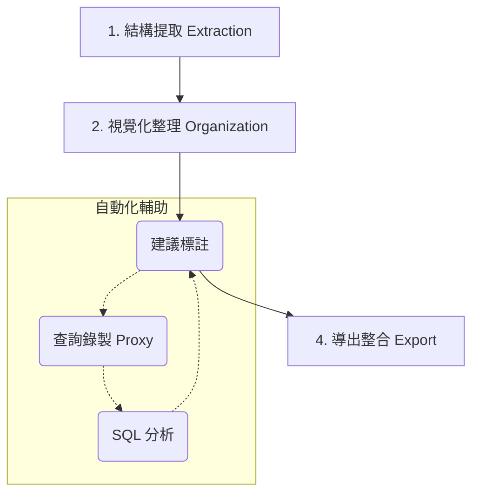

# 🌊 Archivolt 核心工作流指南

本指南詳細說明如何使用 Archivolt 從零開始梳理一套老舊資料庫，並將其轉化為現代化、具備強型別關聯的開發資產。

---

## 🛠️ 整體作業流程

Archivolt 的工作流程分為四個主要階段：



---

## 階段 1：結構提取 (Extraction)

Archivolt 採用「離線分析」模式，這意味著它不直接連線到您的生產環境資料庫，而是透過 JSON 規格書運作。

1. **提取 Schema**：
   使用 [dbcli](https://github.com/CarlLee1983/dbcli) 掃描您的資料庫：
   ```bash
   dbcli schema --format json > my-database.json
   ```
2. **匯入 Archivolt**：
   ```bash
   bun run dev --input my-database.json
   ```
   此時 Archivolt 會解析所有的資料表、欄位、主鍵以及物理外鍵（如果有的話）。

---

## 階段 2：視覺化整理 (Organization)

面對動輒數百張資料表的老舊系統，首要任務是「降噪」。

1. **啟動介面**：執行 `bun run dev:all` 並開啟瀏覽器。
2. **智慧分組 (Smart Grouping)**：
   - Archivolt 會根據資料表前綴（如 `wp_`, `auth_`）或常見的欄位命名慣例自動嘗試分組。
   - 您可以在畫布上將相關的資料表拖入同一個「分組框」中，定義清晰的領域 (Domain) 邊界。
3. **隱藏雜訊**：將不重要的紀錄表、備份表從主畫布中隱藏。

---

## 階段 3：關聯發現與標註 (Discovery & Annotation)

這是最關鍵的一步：找出那些「有名無實」的隱性關聯。

### 1. 手動標註 vFK
如果您已經知道某些關聯（例如 `orders.user_id` 指向 `users.id`），直接在畫布上從一個欄位拉線到另一個欄位。這會建立一個 **虛擬外鍵 (Virtual Foreign Key)**。

### 2. 查詢錄製 (自動發現)
當資料庫結構太過複雜，難以通靈時，請讓 Archivolt 「聽」您的應用程式在說什麼：
1. **啟動錄製代理**：
   ```bash
   bun run dev record start --target production-db:3306 --port 13306
   ```
2. **切換連線**：將您的應用程式（例如 Laravel 的 `.env`）的資料庫 Host 改為 `127.0.0.1`，Port 改為 `13306`。
3. **執行業務流程**：在應用程式操作您想分析的功能。
4. **分析建議**：
   Archivolt 會攔截 SQL 語句。如果它看到 `SELECT * FROM a JOIN b ON a.x = b.y`，它會自動建議您標註 `a.x` 與 `b.y` 之間的虛擬外鍵。

---

## 階段 4：導出與整合 (Export & Integration)

當標註完成後，您可以將這些「數位資產」導出到您的專案中。

### 1. 生成 ORM 模型
- **Laravel Eloquent**：
  ```bash
   bun run dev export eloquent --laravel /path/to/project
  ```
  Archivolt 會掃描您的標註，自動在 PHP Model 中生成 `belongsTo`、`hasMany` 等方法。
- **Prisma**：
  生成具備完整關係定義的 `schema.prisma`。

### 2. 生成技術文件
- **Mermaid/DBML**：
  將當前的標註畫布導出為可嵌入 Markdown 的圖表代碼，確保文件永遠與現狀同步。

---

## 💡 小貼士 (Tips)

- **保持同步**：如果資料庫結構有變動，使用 `--reimport` 旗標重新匯入，Archivolt 會保留您已完成的手動標註。
- **LLM 友善**：生成的 `archivolt.json` 包含了所有的元數據，您可以直接將此檔案提供給 ChatGPT 或 Claude，讓 AI 協助您編寫更複雜的查詢邏輯。
